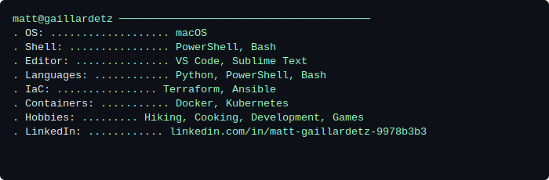

```
M""""""`'"""`YM            dP     dP                                               
M  mm.  mm.  M            88     88                                               
M  MMM  MMM  M .d8888b. d8888P d8888P                                             
M  MMM  MMM  M 88'  `88   88     88                                               
M  MMM  MMM  M 88.  .88   88     88                                               
M  MMM  MMM  M `88888P8   dP     dP                                               
MMMMMMMMMMMMMM                                                                    
                                                                                  
MM'"""""`MM          oo dP dP                         dP            dP            
M' .mmm. `M             88 88                         88            88            
M  MMMMMMMM .d8888b. dP 88 88 .d8888b. 88d888b. .d888b88 .d8888b. d8888P d888888b 
M  MMM   `M 88'  `88 88 88 88 88'  `88 88'  `88 88'  `88 88ooood8   88      .d8P' 
M. `MMM' .M 88.  .88 88 88 88 88.  .88 88       88.  .88 88.  ...   88    .Y8P    
MM.     .MM `88888P8 dP dP dP `88888P8 dP       `88888P8 `88888P'   dP   d888888P 
MMMMMMMMMMM                                                                       
```





